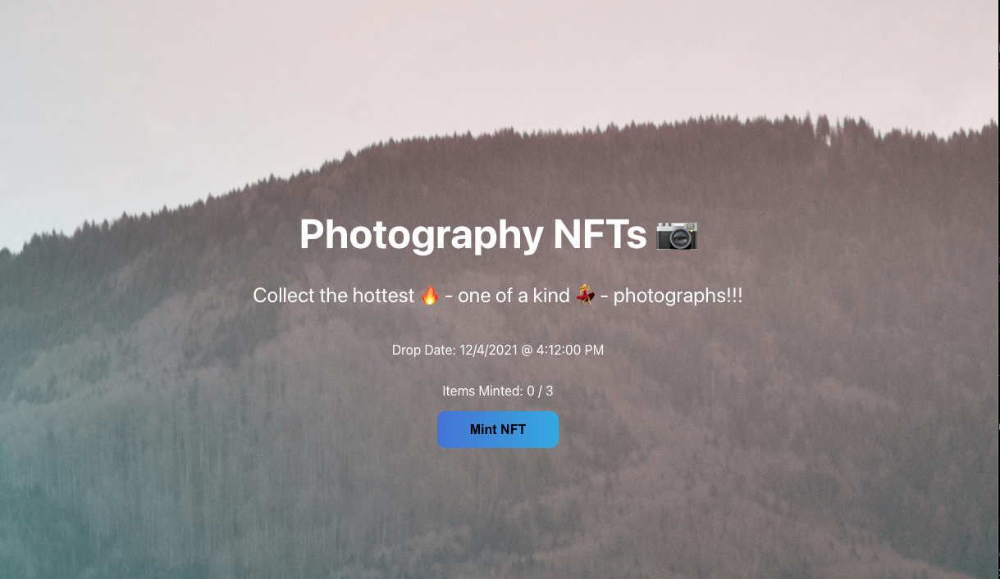

To get started, clone this repo and follow these commands:

1. cd into the `app` folder
2. Run `npm install` at the root of your directory
3. Run `npm run start` to start the project
4. Start coding!

Make sure to create `.env` in the root of `app` folder.

`REACT_APP_CANDY_MACHINE_CONFIG` - This can be found in your .cache/devnet-temp JSON file that was created. Look for the value associated with the `config` key.

`REACT_APP_CANDY_MACHINE_ID` - This can also be found in the same .cache/devnet-temp JSON file, look for the value associated with the `candyMachineAddress` key.

`REACT_APP_TREASURY_ADDRESS` - This can also be found in the same `.cache/devnet-temp` JSON file, look for the value associated with the `authority` key.

`REACT_APP_SOLANA_NETWORK` - Set this to `devnet` as this is just the network in which we are accessing our candy machine from.

`REACT_APP_SOLANA_RPC_HOST` - This is pretty much the same as above. Since we are accessing out Candy Machine on devnet we need to point the RPC to that devnet link which is https://explorer-api.devnet.solana.com

Deployed link: https://vercel.com/linhatran/solana-nfts-drop-website

